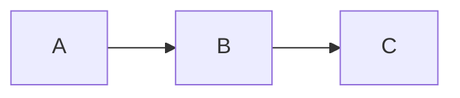
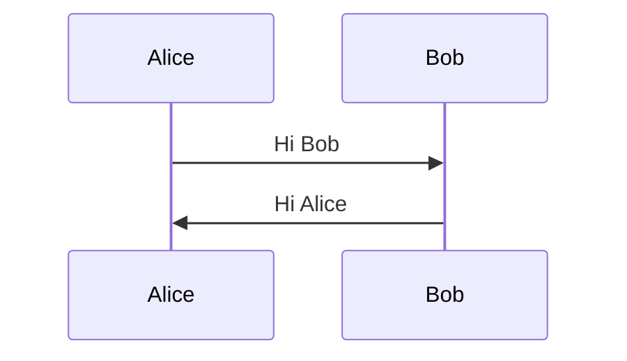

# Title

Description of project.

## Tasks

- [x] Task 1
- [ ] Task 2
- [ ] Task 3

## Diagrams





## Call Outs

> [!NOTE]
> Remember to always save your progress before closing the application.

> [!TIP]
> Use keyboard shortcuts to boost your productivity while working.

> [!IMPORTANT]
> Make sure to regularly back up your data to avoid loss.

> [!WARNING]
> Avoid turning off your computer during updates to prevent system corruption.

> [!CAUTION]
> Be cautious when sharing personal information online; protect your privacy.

## Tables

| Column A       | Column B       |
| :---           |    :----:      |
| Column A Row 1 | Column B Row 1 |
| Column A Row 2 | Column B Row 2 |

## Code

```json
{
    "software": {
        "name": "Name",
        "version": "1.0",
        "features": ["Feature 1", "Feature 2"]
    }
}
```

## Links

- [Documents](https://documents.example.com)

## Environments

- [Development](https://development.example.com)
- [Staging](https://staging.example.com)
- [Production](https://www.example.com)

## Team

- Alice Johnson - Leader
- Bob Smith - Architect
- Charlie Brown - Product Owner (PO)
- David Lee - Developer
- Eva Green - Developer
- Frank White - QA

## Technologies and Tools

- [Java](https://dev.java)
- [Spring Boot](https://spring.io/projects/spring-boot)
- [MongoDB](https://www.mongodb.com)
- [PostgreSQL](https://www.postgresql.org)
- [Kafka](https://kafka.apache.org)
- [AWS SQS](https://aws.amazon.com/sqs)
- [AWS S3](https://aws.amazon.com/s3)
- [LocalStack](https://localstack.cloud)
- [Docker](https://www.docker.com/get-started)
- [Kubernetes](https://kubernetes.io)
- [Testcontainers](https://testcontainers.com)
- [JWT](https://jwt.io)
- [Swagger](https://swagger.io)

## Run

### Prerequisites

- [Java JDK](https://www.oracle.com/java/technologies/downloads)
- [IntelliJ IDEA](https://www.jetbrains.com/idea/download)
- [Docker](https://www.docker.com/get-started)

### Steps

- Open **root** directory in terminal and run **docker compose up**.
- Open **source** directory in **IntelliJ IDEA**.
- Open **Application.java** and click **Run** or **Debug**.
- Visit <https://localhost:8080> in web browser.

## Deployment

- Step 1
- Step 2
- Step 3
