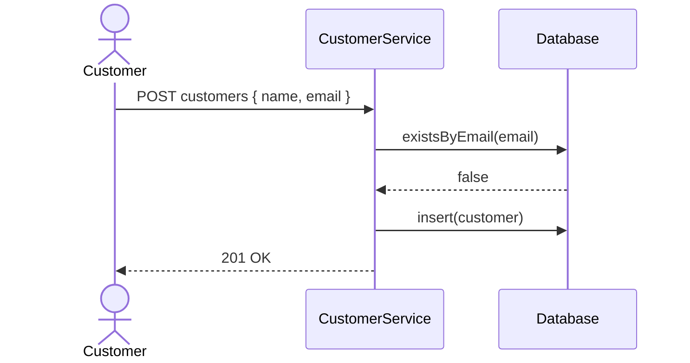
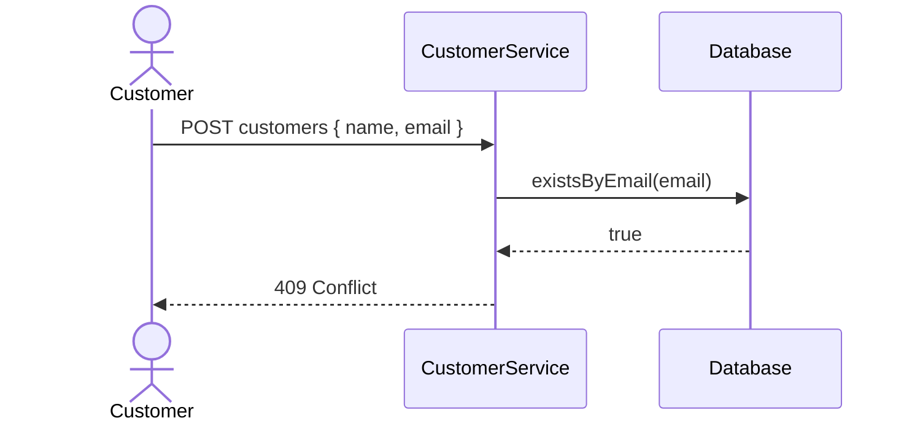

# Customer Registration

## Description

This document presents a refinement of the customer registration.

## Use Cases

### Successful Customer Registration



### Failed Customer Registration (Duplicated E-mail)



## Business Rules

- **Id (UUID, Required, Unique):** Identifier.
- **Name (String, Required, Min = 10, Max = 250):** Name.
- **Email (String, Required, Unique, Min 10, Max 250, Format = Email):** E-mail.
- On successful registration, return a status code of **201 Created** and the message **Customer registered successfully.**
- If the email is already in use, return a status code of **409 Conflict** and the message **Customer with this email already exists.**

## Functional Requirements

- **Validation:** Validate input data.
- **Data Storage:** Store data in database.
- **Duplicate Check:** Ensure unique email.
- **Logging:** Log failed registration attempts.

## Non-Functional Requirements

- **Performance:** Response time under 100 milliseconds.
- **Security:** HTTPS.
- **Scalability:** Support up to 1000 concurrent requests.
- **Availability:** 99.9% uptime.

## Architecture

- **CustomerService:** API (Java, Spring Boot, MongoDB).

## Technical Requirements

### Entity

```java
@AllArgsConstructor
@NoArgsConstructor
@Data
@Document
public class Customer {
    @Id
    private UUID id;

    @NotBlank
    @Size(min = 10, max = 250)
    private String name;

    @NotBlank
    @Size(min = 10, max = 250)
    @Email
    @Indexed(unique = true)
    private String email;
}
```

### Record

```java
record RegisterCustomer(
    @NotBlank @Size(min = 10, max = 250) String name,
    @NotBlank @Size(min = 10, max = 250) @Email String email) { }
```

### Controller

```java
@Tag(name = "Customers")
@RequiredArgsConstructor
@RestController
@RequestMapping("customers")
public class CustomerController {
    private final CustomerService customerService;

    @Operation(summary = "Register")
    @PostApiResponses
    @PostMapping
    @ResponseStatus(HttpStatus.CREATED)
    public ResponseEntity<Map<String, String>> register(@RequestBody @Valid final RegisterCustomer registerCustomer) {
        return customerService.register(registerCustomer);
    }
}
```

### Service

```java
@Service
@RequiredArgsConstructor
public class CustomerService {
    private final CustomerRepository customerRepository;

    public ResponseEntity<Map<String, String>> register(final RegisterCustomer registerCustomer) {
        if (customerRepository.existsByEmail(registerCustomer.email())) {
            return ResponseEntity.status(HttpStatus.CONFLICT).body(Map.of("message", "Customer with this email already exists."));
        }

        final Customer customer = new Customer(UUID.randomUUID(), registerCustomer.name(), registerCustomer.email());
        
        customerRepository.save(customer);
        
        return ResponseEntity.status(HttpStatus.CREATED).body(Map.of("message", "Customer registered successfully."));
    }
}
```

### Repository

```java
@Repository
public interface CustomerRepository extends MongoRepository<Customer, UUID> {
    boolean existsByEmail(String email);
}
```

## Test Cases

### Successful Customer Registration

- **Request**
    - **Uri:** customers
    - **Method:** POST
    - **Body**
      ```json
      {
          "name": "John Doe",
          "email": "johndoe@example.com"
      }
      ```
- **Response**
    - **Status:** 201 Created
    - **Body**
      ```json
      {
          "message": "Customer registered successfully."
      }
      ```

### Failed Customer Registration (Duplicated E-mail)

- **Request**
    - **Uri:** customers
    - **Method:** POST
    - **Body**
      ```json
      {
          "name": "Jane Smith",
          "email": "johndoe@example.com"
      }
      ```
- **Response**
    - **Status:** 409 Conflict
    - **Body**
      ```json
      {
          "message": "Customer with this email already exists."
      }
      ```