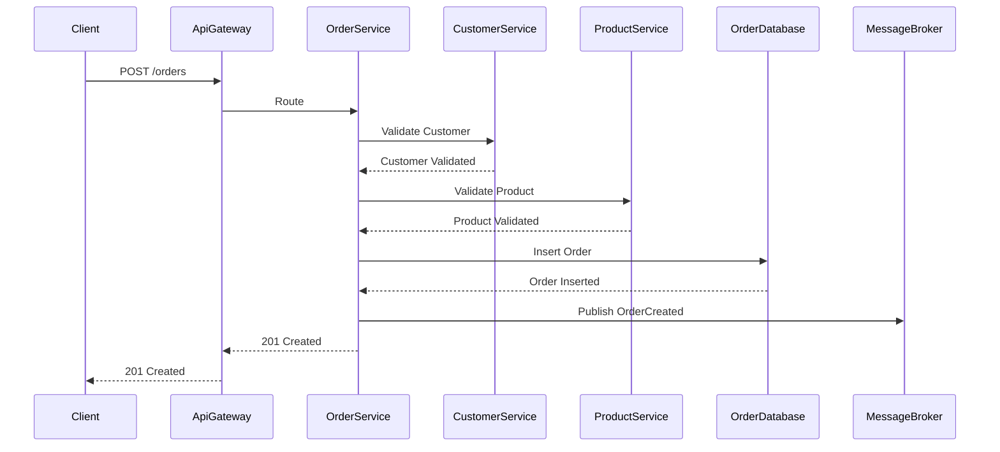

# System Design


## System Overview

The system manages authentication, authorization, customers, products and orders using a microservices architecture.

### Functional Requirements

- **Authentication and Authorization Management**: Operations for login and access control.
- **Customer Management**: CRUD operations for customers.
- **Product Management**: CRUD operations for products.
- **Order Management**: Operations for create orders and update statuses.

### Non-Functional Requirements

- **Scalability**: Handle 10,000+ concurrent users.
- **Availability**: 99.9% uptime with minimal downtime during updates.
- **Security**: Role-based access control, encrypted communication, secure data storage.
- **Performance**: < 500ms latency for responses.
- **Resilience**: Graceful degradation under high load or partial failures.

## Overall Architecture

### Main Components

- **Load Balancer:** distributes traffic across servers to ensure reliability and prevent overload.
- **API Gateway:** handles request routing, load balancing, authentication, data transformation, monitoring, rate limiting, request caching, response aggregation, API versioning, and error handling.
- **Distributed Computing Patterns:** Retry, Circuit Breaker, Idempotent, Saga, Outbox, and Sharding.
- **Communication:** Synchronously via HTTP or asynchronously through events using Message Broker.
- **Design:** Architecture, Domain-Driven Design, Language, Framework, Data Model.
- **Test Pyramid:** Unit, Integration, E2E.
- **DevOps:** Continuous Integration (CI) and Continuous Delivery (CD).
- **Deploy:** Blue-Green Deployment or Canary Releases.
- **Message Broker**: Asynchronous communication (RabbitMQ or Kafka).
- **Cache**: Redis for low-latency data access.
- **Monitoring & Logging**: ELK Stack for logs, Grafana/Prometheus for metrics.
- **Image Registry**: Stores container images for deployment.
- **Microservices**:
   - **AuthService**: Manages authentication and authorization.
   - **CustomerService**: Manages customers.
   - **ProductService**: Manages products.
   - **OrderService**: Manages orders.
- **Databases**: Dedicated database per microservice for data isolation.

## Detailed Microservices

### AuthService

#### Responsibilities

- Authentication and authorization.
- Role-based access control (ADMIN, CUSTOMER).

#### Technologies

- **Framework**: Java, Spring Boot
- **Database**: PostgreSQL
- **Authentication**: JWT

#### Data Model

- **Users Table**

  | Column   | Type   | Constraints                 |
  | -------- | ------ | --------------------------- |
  | id       | UUID   | PK                          |
  | email    | String | Not Null, Unique            |
  | password | String | Not Null, Hash              |
  | role     | String | Not Null, (ADMIN, CUSTOMER) |

#### Endpoints

- `POST /auth`

  - **Request**

    ```json
    {
      "email": "user@example.com",
      "password": "pass123",
      "role": "CUSTOMER"
    }
    ```

  - **Response**: `201 Created`

    ```json
    {
      "id": "123e4567-e89b-12d3-a456-426614174000"
    }
    ```

- `POST /auth/login`

  - **Request**

    ```json
    {
      "email": "user@example.com",
      "password": "pass123"
    }
    ```

  - **Response**: `200 OK`

    ```json
    {
      "token": "eyJhbGciOiJIUzI1NiIsInR5cCI6IkpXVCJ9...",
      "expiresAt": "0000-00-00T00:00:00Z"
    }
    ```

- `GET /auth/validate`

  - **Headers**: `Authorization: Bearer <token>`

  - **Response**: `200 OK`

    ```json
    {
      "id": "123e4567-e89b-12d3-a456-426614174000",
      "role": "CUSTOMER"
    }
    ```

---

### CustomerService

#### Responsibilities

- Manage customers.
- Validate customer (email).

#### Technologies

- **Framework**: Node.js, Express.js
- **Database**: MongoDB

#### Data Model

- **Customers Collection**

  ```json
  {
    "_id": "Id",
    "name": "String",
    "email": "String",
    "address": {
      "street": "String",
      "number": "String",
      "complement": "String",
      "neighborhood": "String",
      "zipcode": "String",
      "city": "String",
      "state": "String",
      "country": "String"
    },
    "createdAt": "DateTime"
  }
  ```

#### Endpoints

- `POST /customers`

  - **Request**

    ```json
    {
      "name": "Name",
      "email": "name@example.com",
      "address": {
        "street": "Street",
        "number": "123",
        "complement": "Complement",
        "neighborhood": "Neighborhood",
        "zipcode": "12345",
        "city": "City",
        "state": "State",
        "country": "Country"
      }
    }
    ```

  - **Response**: `201 Created`

    ```json
    {
      "_id": "507f1f77bcf86cd799439011"
    }
    ```

- `GET /customers/:id`

  - **Response**: `200 OK`

    ```json
    {
      "_id": "507f1f77bcf86cd799439011",
      "name": "Name",
      "email": "name@example.com",
      "address": {
        "street": "Street",
        "number": "123",
        "complement": "Complement",
        "neighborhood": "Neighborhood",
        "zipcode": "12345",
        "city": "City",
        "state": "State",
        "country": "Country"
      },
      "createdAt": "0000-00-00T00:00:00Z"
    }
    ```

- `PUT /customers/:id`

  - **Request**

    ```json
    {
      "name": "Name",
      "email": "name@example.com",
      "address": {
        "street": "Street",
        "number": "123",
        "complement": "Complement",
        "neighborhood": "Neighborhood",
        "zipcode": "12345",
        "city": "City",
        "state": "State",
        "country": "Country"
      }
    }
    ```

  - **Response**: `204 No Content`

- `DELETE /customers/:id`

  - **Response**: `204 No Content`

---

### ProductService

#### Responsibilities

- Manage products.
- Validate product (price >= 0).

#### Technologies

- **Framework**: Python, Django
- **Database**: PostgreSQL
- **Cache**: Redis

#### Data Model

- **Products Table**

  | Column      | Type    | Constraints    |
  | ----------- | ------- | -------------- |
  | id          | UUID    | PK             |
  | name        | String  | Not Null       |
  | description | String  |                |
  | price       | Decimal | Not Null, >= 0 |
  | stock       | Integer | Not Null, >= 0 |

#### Endpoints

- `POST /products`

  - **Request**

    ```json
    {
      "name": "Product",
      "description": "Description",
      "price": 1000,
      "stock": 100
    }
    ```

  - **Response**: `201 Created`

    ```json
    {
      "id": "507f1f77bcf86cd799439012"
    }
    ```

- `GET /products/:id`

  - **Response**: `200 OK`

    ```json
    {
      "id": "507f1f77bcf86cd799439012",
      "name": "Product",
      "description": "Description",
      "price": 1000,
      "stock": 100
    }
    ```

- `PUT /products/:id`

  - **Request**

    ```json
    {
      "name": "Product",
      "description": "Description",
      "price": 1500,
      "stock": 50
    }
    ```

  - **Response**: `204 No Content`

- `DELETE /products/:id`

  - **Response**: `204 No Content`

---

### OrderService

#### Responsibilities

- Manage orders.
- Validates customer and product existence before order creation.
- Publishes **OrderCreated** event to message broker.

#### Technologies

- **Framework**: Go, Gin
- **Database**: MySQL

#### Data Model

- **Orders Table**

  | Column     | Type     | Constraints                    |
  | ---------- | -------- | ------------------------------ |
  | id         | UUID     | PK                             |
  | customerId | UUID     | FK                             |
  | productId  | UUID     | FK                             |
  | quantity   | Decimal  | Not Null                       |
  | price      | Decimal  | Not Null                       |
  | status     | String   | Not Null, (PENDING, COMPLETED) |
  | createdAt  | DateTime | Not Null                       |

#### Endpoints

- `POST /orders`

  - **Request**

    ```json
    {
      "customerId": "507f1f77bcf86cd799439011",
      "productId": "507f1f77bcf86cd799439012",
      "quantity": 1
    }
    ```

  - **Response**: `201 Created`

    ```json
    {
      "id": "507f1f77bcf86cd799439013"
    }
    ```

- `GET /orders/:id`

  - **Response**: `200 OK`

    ```json
    {
      "id": "507f1f77bcf86cd799439013",
      "customerId": "507f1f77bcf86cd799439011",
      "productId": "507f1f77bcf86cd799439012",
      "quantity": 1,
      "price": 1000,
      "status": "PENDING",
      "createdAt": "0000-00-00T00:00:00Z"
    }
    ```

- `PUT /orders/:id/status/COMPLETED`

  - **Response**: `204 No Content`

## Example Flow: Order Creation

```
1. Client sends POST /orders to API Gateway.
2. API Gateway routes to OrderService.
3. OrderService validates customer with CustomerService.
4. OrderService validates product with ProductService.
5. OrderService inserts order to Database.
6. OrderService publishes OrderCreated event to Message Broker.
7. OrderService responds with 201 Created.
8. API Gateway responds with 201 Created.
```



---

## Final Considerations

- **Scalability**: Kubernetes auto-scaling based on CPU and memory usage.
- **Security**: HTTPS, JWT, input validation, and RBAC.
- **Monitoring**: ELK for log management, Grafana/Prometheus for metrics and alerts.
- **Resilience**: Circuit breakers, retries, and timeouts for inter-service communication.
- **Deployment**: Zero-downtime rolling updates with Kubernetes.
