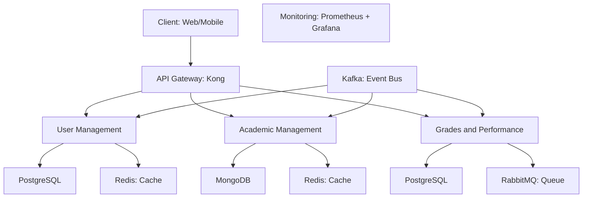
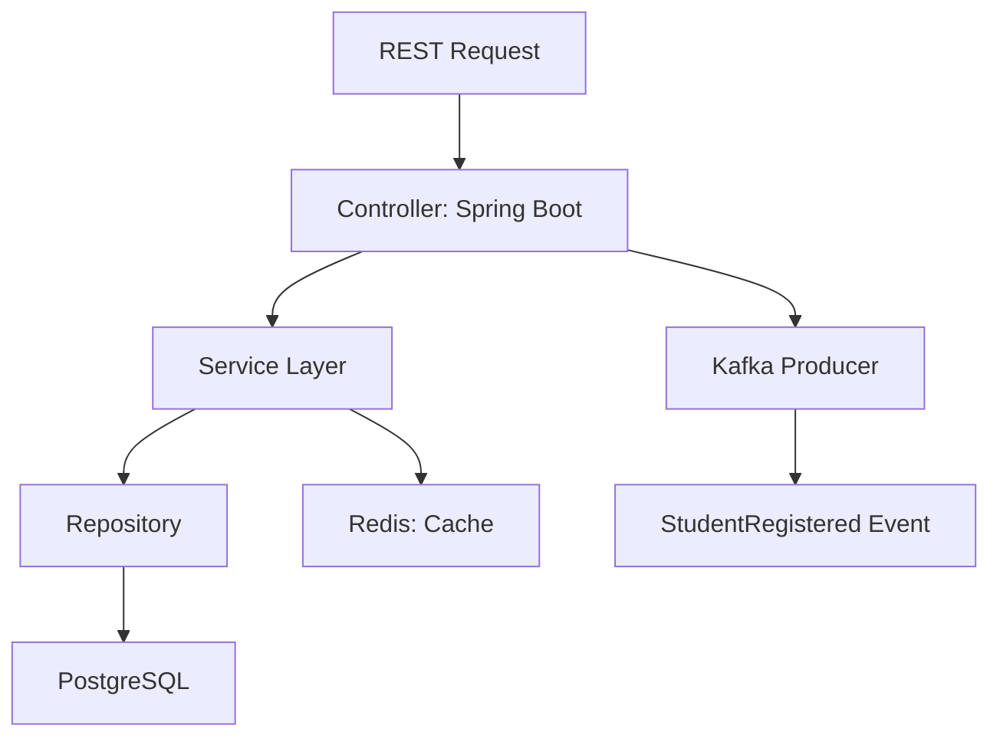
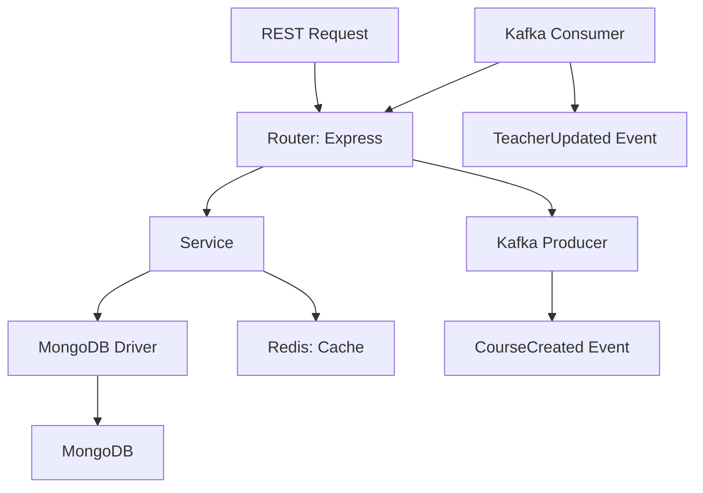
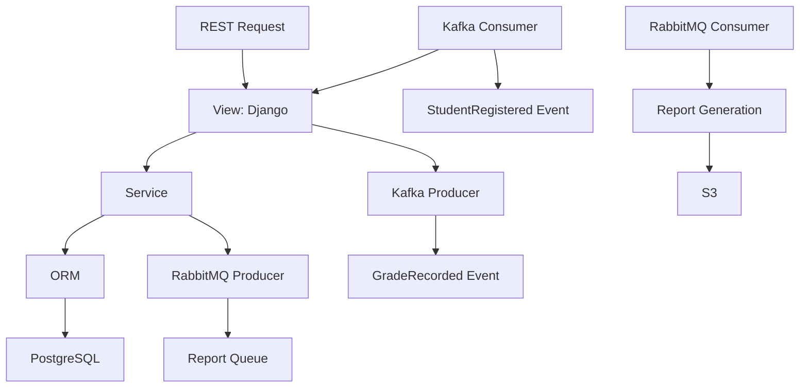
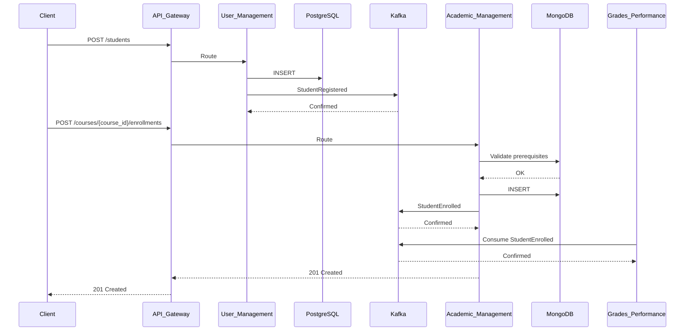
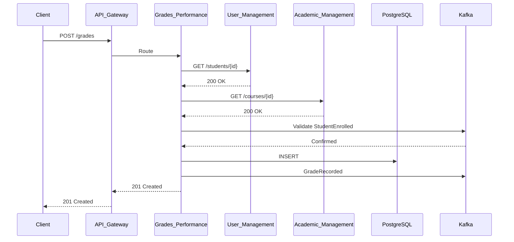

# System Design: Educational Management System

## System Overview

The system is designed to manage an educational institution, handling entities such as schools, students, teachers, courses, curricula, enrollments, and grades. It follows a microservices architecture with synchronous (REST) and asynchronous (event-driven) communication, ensuring scalability, resilience, and separation of concerns.

### Functional Requirements
- Register, query, update, and delete students and teachers.
- Create and manage courses, curricula, and enrollments.
- Record and retrieve grades, including calculating averages, approval status, and generating reports.
- Provide academic history for students.

### Non-Functional Requirements
- **Scalability**: Support thousands of students and teachers.
- **Availability**: 99.9% uptime.
- **Security**: Robust authentication and role-based authorization.
- **Performance**: Responses under 500ms for simple queries.

---

## Overall Architecture

### Main Components
1. **API Gateway**: Single entry point for all requests.
2. **Microservices**:
   - User Management
   - Academic Management
   - Grades and Performance
3. **Event Bus**: Asynchronous communication between microservices.
4. **Databases**: One per microservice (Database per Service pattern).
5. **Cache**: For frequently accessed data.
6. **Monitoring**: Logs and metrics collection.

### Architecture Diagram

```mermaid
graph TD
    A[Client: Web/Mobile] --> B[API Gateway: Kong]
    B --> C[User Management]
    B --> D[Academic Management]
    B --> E[Grades and Performance]
    C --> F[PostgreSQL]
    C --> G[Redis: Cache]
    D --> H[MongoDB]
    D --> I[Redis: Cache]
    E --> J[PostgreSQL]
    E --> K[RabbitMQ: Queue]
    L[Kafka: Event Bus] --> C
    L --> D
    L --> E
    M[Monitoring: Prometheus + Grafana]
```

---

## Detailed Microservices

### 1. User Management Microservice

#### Responsibilities
- Manage student and teacher registrations, updates, and deletions.
- Handle authentication and role-based authorization.
- Validate data.

#### Technologies
- **Framework**: Spring Boot (Java)
- **Database**: PostgreSQL
- **Cache**: Redis (stores JWT tokens)
- **Authentication**: JWT with asymmetric keys, role-based claims

#### Internal Diagram

```mermaid
graph TD
    A[REST Request] --> B[Controller: Spring Boot]
    B --> C[Service Layer]
    C --> D[Repository]
    D --> E[PostgreSQL]
    C --> F[Redis: Cache]
    B --> G[Kafka Producer]
    G --> H[StudentRegistered Event]
```

#### Data Model

- **Students Table**

  | Column       | Type            | Constraints                     |
  |-------------|----------------|---------------------------------|
  | `id`        | UUID           | Primary Key                     |
  | `name`      | VARCHAR        |                                 |
  | `student_code` | VARCHAR     | UNIQUE                          |
  | `email`     | VARCHAR        | UNIQUE                          |
  | `birth_date` | DATE          |                                 |
  | `role`      | VARCHAR (ENUM) | 'STUDENT', 'TEACHER', 'ADMIN'   |
  | `created_at` | TIMESTAMP     |                                 |
  | `updated_at` | TIMESTAMP     |                                 |

- **Teachers Table**

  | Column      | Type            | Constraints                     |
  |------------|----------------|---------------------------------|
  | `id`       | UUID           | Primary Key                     |
  | `name`     | VARCHAR        |                                 |
  | `specialty` | VARCHAR       |                                 |
  | `email`    | VARCHAR        | UNIQUE                          |
  | `role`     | VARCHAR (ENUM) | 'STUDENT', 'TEACHER', 'ADMIN'   |
  | `created_at` | TIMESTAMP     |                                 |
  | `updated_at` | TIMESTAMP     |                                 |

#### Endpoints
- `POST /students` - Create a student.
  - **Body**: 
    ```json
    {
      "name": "John Smith",
      "student_code": "2023001",
      "email": "john@school.com",
      "birth_date": "2005-03-15",
      "role": "STUDENT"
    }
    ```
  - **Response**: `201 Created` 
    ```json
    {
      "id": "550e8400-e29b-41d4-a716-446655440000",
      "name": "John Smith",
      "student_code": "2023001",
      "email": "john@school.com",
      "birth_date": "2005-03-15",
      "role": "STUDENT",
      "created_at": "2025-03-27T10:00:00Z"
    }
    ```
- `GET /students/{id}` - Retrieve a student.
  - **Response**: `200 OK`
    ```json
    {
      "id": "550e8400-e29b-41d4-a716-446655440000",
      "name": "John Smith",
      "student_code": "2023001",
      "email": "john@school.com",
      "birth_date": "2005-03-15",
      "role": "STUDENT",
      "created_at": "2025-03-27T10:00:00Z"
    }
    ```
- `PUT /students/{id}` - Update a student.
  - **Body**: 
    ```json
    {
      "name": "John A. Smith",
      "email": "john.a@school.com"
    }
    ```
  - **Response**: `200 OK`
- `DELETE /students/{id}` - Delete a student (if no enrollments exist).
  - **Response**: `204 No Content`
- `POST /auth/login` - Authenticate a user.
  - **Body**: 
    ```json
    {
      "email": "john@school.com",
      "password": "123456"
    }
    ```
  - **Response**: `200 OK`
    ```json
    {
      "token": "eyJhbGciOiJIUzI1NiIsInR5cCI6IkpXVCJ9...",
      "role": "STUDENT"
    }
    ```

#### Events
- **Published**:
  - `StudentRegistered` 
    ```json
    {
      "id": "550e8400-e29b-41d4-a716-446655440000",
      "student_code": "2023001"
    }
    ```

---

### 2. Academic Management Microservice

#### Responsibilities
- Manage courses, curricula, and student enrollments.
- Associate teachers with courses.
- Validate prerequisites for enrollments.
- Provide academic information queries.

#### Technologies
- **Framework**: Express (Node.js)
- **Database**: MongoDB
- **Cache**: Redis (popular courses)

#### Internal Diagram

```mermaid
graph TD
    A[REST Request] --> B[Router: Express]
    B --> C[Service]
    C --> D[MongoDB Driver]
    D --> E[MongoDB]
    C --> F[Redis: Cache]
    B --> G[Kafka Producer]
    G --> H[CourseCreated Event]
    I[Kafka Consumer] --> B
    I --> J[TeacherUpdated Event]
```

#### Data Model
- **Courses Collection**
  ```json
  {
    "_id": "507f1f77bcf86cd799439011",
    "name": "Basic Mathematics",
    "description": "Introductory course",
    "workload_hours": 60,
    "teachers": ["550e8400-e29b-41d4-a716-446655440001", "550e8400-e29b-41d4-a716-446655440002"],
    "created_at": "2025-03-27T10:00:00Z",
    "updated_at": "2025-03-27T10:00:00Z"
  }
  ```
- **Curricula Collection**
  ```json
  {
    "_id": "507f191e810c19729de860ea",
    "course_id": "507f1f77bcf86cd799439011",
    "subjects": [
      {
        "name": "Algebra",
        "workload_hours": 20,
        "prerequisites": []
      },
      {
        "name": "Calculus",
        "workload_hours": 40,
        "prerequisites": ["Algebra"]
      }
    ],
    "updated_at": "2025-03-27T10:00:00Z"
  }
  ```
- **Enrollments Collection**
  ```json
  {
    "_id": "507f191e810c19729de860eb",
    "student_id": "550e8400-e29b-41d4-a716-446655440000",
    "course_id": "507f1f77bcf86cd799439011",
    "enrollment_date": "2025-03-27T10:00:00Z"
  }
  ```

#### Endpoints
- `POST /courses` - Create a course.
  - **Body**: 
    ```json
    {
      "name": "Basic Mathematics",
      "description": "Introductory course",
      "workload_hours": 60
    }
    ```
- `PUT /courses/{id}` - Update a course.
  - **Body**: 
    ```json
    {
      "description": "Updated introductory course"
    }
    ```
- `DELETE /courses/{id}` - Delete a course (if no enrollments exist).
  - **Response**: `204 No Content`
- `GET /courses/{id}/curriculum` - Retrieve curriculum.
  - **Response**: `200 OK`
    ```json
    {
      "course_id": "507f1f77bcf86cd799439011",
      "subjects": [
        {
          "name": "Algebra",
          "workload_hours": 20,
          "prerequisites": []
        },
        {
          "name": "Calculus",
          "workload_hours": 40,
          "prerequisites": ["Algebra"]
        }
      ]
    }
    ```
- `POST /courses/{course_id}/enrollments/students/{student_id}` - Enroll a student (validates prerequisites).
  - **Response**: `201 Created` or `400 Bad Request` (if prerequisites not met)
- `POST /courses/{course_id}/teachers/{teacher_id}` - Assign a teacher.

#### Events
- **Published**:
  - `CourseCreated` 
    ```json
    {
      "course_id": "507f1f77bcf86cd799439011",
      "name": "Basic Mathematics"
    }
    ```
  - `StudentEnrolled` 
    ```json
    {
      "student_id": "550e8400-e29b-41d4-a716-446655440000",
      "course_id": "507f1f77bcf86cd799439011"
    }
    ```
  - `CurriculumUpdated` 
    ```json
    {
      "course_id": "507f1f77bcf86cd799439011",
      "subjects": [
        {
          "name": "Algebra",
          "workload_hours": 20,
          "prerequisites": []
        },
        {
          "name": "Calculus",
          "workload_hours": 40,
          "prerequisites": ["Algebra"]
        }
      ]
    }
    ```

---

### 3. Grades and Performance Microservice

#### Responsibilities
- Record and retrieve grades with approval rules.
- Calculate averages and approval status (e.g., minimum grade 7.0).
- Generate asynchronous performance reports and provide status feedback.
- Provide academic history for students.

#### Technologies
- **Framework**: Django (Python)
- **Database**: PostgreSQL
- **Queue**: RabbitMQ (report processing)
- **Storage**: AWS S3 (reports)

#### Internal Diagram

```mermaid
graph TD
    A[REST Request] --> B[View: Django]
    B --> C[Service]
    C --> D[ORM]
    D --> E[PostgreSQL]
    C --> F[RabbitMQ Producer]
    F --> G[Report Queue]
    B --> H[Kafka Producer]
    H --> I[GradeRecorded Event]
    J[Kafka Consumer] --> B
    J --> K[StudentRegistered Event]
    L[RabbitMQ Consumer] --> M[Report Generation]
    M --> N[S3]
```

#### Data Model

- **Grades Table**
  ```sql
  id (UUID, PK)
  student_id (UUID, FK)
  course_id (UUID, FK)
  subject (VARCHAR)
  value (DECIMAL)
  semester (VARCHAR)
  approval_status (VARCHAR, ENUM: 'APPROVED', 'FAILED', 'PENDING')
  recorded_at (TIMESTAMP)
  ```

#### Endpoints
- `POST /grades` - Record a grade (validates enrollment).
  - **Body**: 
    ```json
    {
      "student_id": "550e8400-e29b-41d4-a716-446655440000",
      "course_id": "507f1f77bcf86cd799439011",
      "subject": "Algebra",
      "value": 8.5,
      "semester": "2025-1"
    }
    ```
- `PUT /grades/{id}` - Update a grade.
  - **Body**: 
    ```json
    {
      "value": 9.0
    }
    ```
- `GET /students/{id}/grades` - List grades.
  - **Response**: `200 OK`
    ```json
    [
      {
        "subject": "Algebra",
        "value": 8.5,
        "semester": "2025-1",
        "approval_status": "APPROVED"
      }
    ]
    ```
- `GET /students/{id}/academic-history` - Retrieve academic history.
  - **Response**: `200 OK`
    ```json
    [
      {
        "course_id": "507f1f77bcf86cd799439011",
        "semester": "2025-1",
        "grades": [
          {
            "subject": "Algebra",
            "value": 8.5,
            "approval_status": "APPROVED"
          }
        ]
      }
    ]
    ```
- `GET /courses/{id}/report` - Request a report (asynchronous).
  - **Response**: `202 Accepted`
    ```json
    {
      "report_id": "550e8400-e29b-41d4-a716-446655440002"
    }
    ```
- `GET /reports/{report_id}/status` - Check report status.
  - **Response**: `200 OK`
    ```json
    {
      "report_id": "550e8400-e29b-41d4-a716-446655440002",
      "status": "COMPLETED",
      "url": "s3://report.pdf"
    }
    ```

#### Events
- **Published**:
  - `GradeRecorded` 
    ```json
    {
      "student_id": "550e8400-e29b-41d4-a716-446655440000",
      "course_id": "507f1f77bcf86cd799439011",
      "value": 8.5,
      "approval_status": "APPROVED"
    }
    ```
  - `ReportGenerated` 
    ```json
    {
      "report_id": "550e8400-e29b-41d4-a716-446655440002",
      "url": "s3://report.pdf"
    }
    ```
- **Consumed**:
  - `StudentRegistered` (validates student)
  - `CourseCreated` (validates course)
  - `StudentEnrolled` (validates enrollment)

---

## Example Flows

### Flow 1: Student Registration and Enrollment

```
1. [Client] --> POST /students --> [API Gateway]
2. [API Gateway] --> [User Management]
3. [User Management] --> Save to [PostgreSQL]
4. [User Management] --> Publish [StudentRegistered] to [Kafka]
5. [Client] --> POST /courses/{course_id}/enrollments --> [API Gateway]
6. [API Gateway] --> [Academic Management]
7. [Academic Management] --> Validate prerequisites --> [MongoDB]
8. [Academic Management] --> Save to [MongoDB]
9. [Academic Management] --> Publish [StudentEnrolled] to [Kafka]
10. [Grades and Performance] --> Consume [StudentEnrolled] and update cache
11. [Academic Management] --> Respond to [Client] with 201 Created
```


```mermaid
sequenceDiagram
    participant Client
    participant API_Gateway
    participant User_Management
    participant PostgreSQL
    participant Kafka
    participant Academic_Management
    participant MongoDB
    participant Grades_Performance
    
    Client ->> API_Gateway: POST /students
    API_Gateway ->> User_Management: Route
    User_Management ->> PostgreSQL: INSERT
    User_Management ->> Kafka: StudentRegistered
    Kafka -->> User_Management: Confirmed
    
    Client ->> API_Gateway: POST /courses/{course_id}/enrollments
    API_Gateway ->> Academic_Management: Route
    Academic_Management ->> MongoDB: Validate prerequisites
    MongoDB -->> Academic_Management: OK
    Academic_Management ->> MongoDB: INSERT
    Academic_Management ->> Kafka: StudentEnrolled
    Kafka -->> Academic_Management: Confirmed
    Grades_Performance ->> Kafka: Consume StudentEnrolled
    Kafka -->> Grades_Performance: Confirmed
    Academic_Management -->> API_Gateway: 201 Created
    API_Gateway -->> Client: 201 Created
```

### Flow 2: Grade Recording

```
1. [Client] --> POST /grades --> [API Gateway]
2. [API Gateway] --> [Grades and Performance]
3. [Grades and Performance] --> Query [User Management] (GET /students/{id})
4. [Grades and Performance] --> Query [Academic Management] (GET /courses/{id})
5. [Grades and Performance] --> Validate enrollment --> [Kafka]
6. [Grades and Performance] --> Save to [PostgreSQL]
7. [Grades and Performance] --> Publish [GradeRecorded] to [Kafka]
8. [Grades and Performance] --> Respond to [Client] with 201 Created
```


```mermaid
sequenceDiagram
    participant Client
    participant API_Gateway
    participant Grades_Performance
    participant User_Management
    participant Academic_Management
    participant PostgreSQL
    participant Kafka
    Client ->> API_Gateway: POST /grades
    API_Gateway ->> Grades_Performance: Route
    Grades_Performance ->> User_Management: GET /students/{id}
    User_Management -->> Grades_Performance: 200 OK
    Grades_Performance ->> Academic_Management: GET /courses/{id}
    Academic_Management -->> Grades_Performance: 200 OK
    Grades_Performance ->> Kafka: Validate StudentEnrolled
    Kafka -->> Grades_Performance: Confirmed
    Grades_Performance ->> PostgreSQL: INSERT
    Grades_Performance ->> Kafka: GradeRecorded
    Grades_Performance -->> API_Gateway: 201 Created
    API_Gateway -->> Client: 201 Created
```

---

## Final Considerations

- **Scalability**: Kubernetes for container orchestration.
- **Security**: HTTPS, JWT with role-based claims, and input validation.
- **Monitoring**: Centralized logging with ELK Stack.
- **Resilience**: Circuit Breakers (e.g., Hystrix) for inter-service calls.

--- 